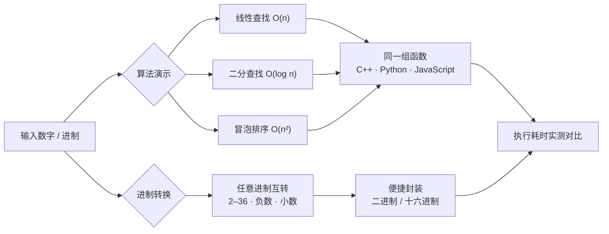
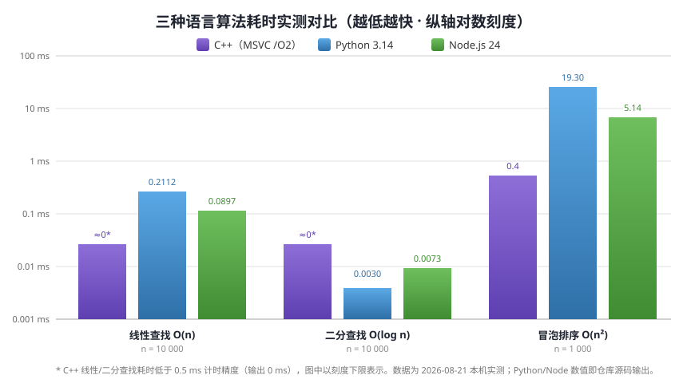

# base-conversion

<p align="center">
  
  
  
  
  
</p>

一个用 **C++、Python、JavaScript 三种语言**实现的进制转换与算法时间复杂度演示项目，适合算法初学者对照学习。每份源码都包含同一组函数：任意进制互转、线性查找、二分查找与冒泡排序，并**实测各自的执行耗时**。

## 三语对照一览



## 实测数据（2026-08-21 本机运行仓库源码）

<p align="center">
  
</p>

| 算法 | C++（MSVC /O2） | Python 3.14 | Node.js 24 |
|---|---|---|---|
| 线性查找 O(n)，n = 10 000 | ≈0 ms* | 0.2112 ms | 0.0897 ms |
| 二分查找 O(log n)，n = 10 000 | ≈0 ms* | 0.0030 ms | 0.0073 ms |
| 冒泡排序 O(n²)，n = 1 000 | 0.4 ms | 19.30 ms | 5.14 ms |

\* C++ 线性/二分查找耗时低于 0.5 ms 计时精度（源码输出 0 ms），图中以刻度下限表示。

## 功能特性

- **2–36 任意进制互转**：`decimalToBase`、`baseToDecimal`、`baseToBase` 三种语言实现一致，输入输出以字符串处理，符号集 `0-9A-Z`。
- **支持负数与小数**：转换函数可处理负号、小数点后的分数部分（例如 `0.5 → 0.1₂`、`10.5 → A.8₁₆`），并覆盖 0 与超大/超小数字等边界情况。
- **二进制/十六进制便捷封装**：内置 `decimalToBinary`、`binaryToDecimal`、`decimalToHex`、`hexToDecimal` 等快捷函数。
- **经典算法演示**：线性查找 O(n)、二分查找 O(log n)（要求有序数组）、冒泡排序 O(n²)，三种语言实现完全相同，便于逐行对照。
- **执行时间实测**：使用 `std::chrono`（C++）、`time.perf_counter()`（Python）、`performance.now()`（JavaScript）统计各算法在 10000/1000 元素上的实际耗时。
- **命令行转换模式**：Python 与 JavaScript 版本支持 `--convert` 直接做进制转换。
- **JSON 批量测试框架**（C++）：自带一个轻量 JSON 解析器，可从 JSON 测试用例文件批量执行 `TRANSLATION` 与 `EXPRESSION` 类型的用例，并输出逐条耗时、复杂度分析与 PASS/FAIL 汇总。

## 技术栈

- C++（C++11，仅标准库）
- Python 3（仅标准库）
- JavaScript / Node.js（无第三方依赖）
- 无数据库、无外部依赖

## 快速开始

### Python

```bash
# 运行全部内置测试与耗时对比
python3 src/benchmark.py --test

# 命令行进制转换
python3 src/benchmark.py --convert --number 255 --from-base 10 --to-base 16   # 输出 FF
python3 src/benchmark.py --convert --number FF --from-base 16 --to-base 2     # 输出 11111111
```

### Node.js

```bash
# 运行全部内置测试与耗时对比
node src/benchmark.js

# 命令行进制转换
node src/benchmark.js --convert 255 10 16     # 输出 FF
node src/benchmark.js --convert FF 16 2       # 输出 11111111
```

### C++

```bash
g++ -O2 -std=c++11 src/benchmark.cpp -o benchmark
./benchmark
```

C++ 版除内置测试外，支持传入 JSON 测试用例文件路径作为命令行参数执行批量测试：

```bash
./benchmark path/to/cases.json
```

不带参数时只运行内置测试。

#### JSON 测试用例格式

顶层为数组，每个用例是一个对象，字段如下：

| 字段 | 类型 | 说明 |
|---|---|---|
| `type` | string | `TRANSLATION`（进制转换）或 `EXPRESSION`（算术表达式求值后再转换） |
| `input_base` | number | 输入进制（2–36），EXPRESSION 类型忽略 |
| `input_number` | string | 输入数字，EXPRESSION 类型为算术表达式（如 `"2+3"`） |
| `output_base` | number | 目标进制（2–36） |
| `output_number` | string | 期望输出 |

示例：

```json
[
  {"type":"TRANSLATION","input_base":10,"input_number":"255","output_base":16,"output_number":"FF"},
  {"type":"TRANSLATION","input_base":3,"input_number":"100110","output_base":16,"output_number":"FF"},
  {"type":"EXPRESSION","input_base":10,"input_number":"2+3","output_base":10,"output_number":"5"}
]
```

## 配置

本项目无需任何环境变量或配置文件。

## 项目结构

```
base-conversion/
├── src/
│   ├── benchmark.cpp   # C++ 实现（含 JSON 批量测试框架）
│   ├── benchmark.py    # Python 实现（含 --test / --convert CLI）
│   └── benchmark.js    # Node.js 实现（含 --convert CLI）
├── docs/images/        # 文档配图（实测对比图）
└── reports/           # 运行输出目录（已被 .gitignore 排除，不入库）
```

## 许可证

[MIT License](LICENSE)
